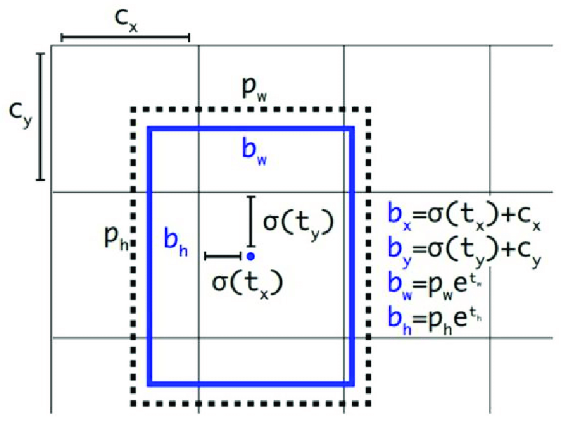
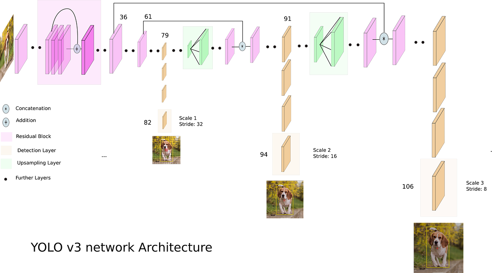

# YoloV3

Anchor boxes from pretrained yolo model(using k means clustering)

Makes (5+80) predictions for every bounding box

Paper: https://arxiv.org/pdf/1804.02767

Weights: https://github.com/patrick013/Object-Detection---Yolov3/blob/master/model/yolov3.weights

